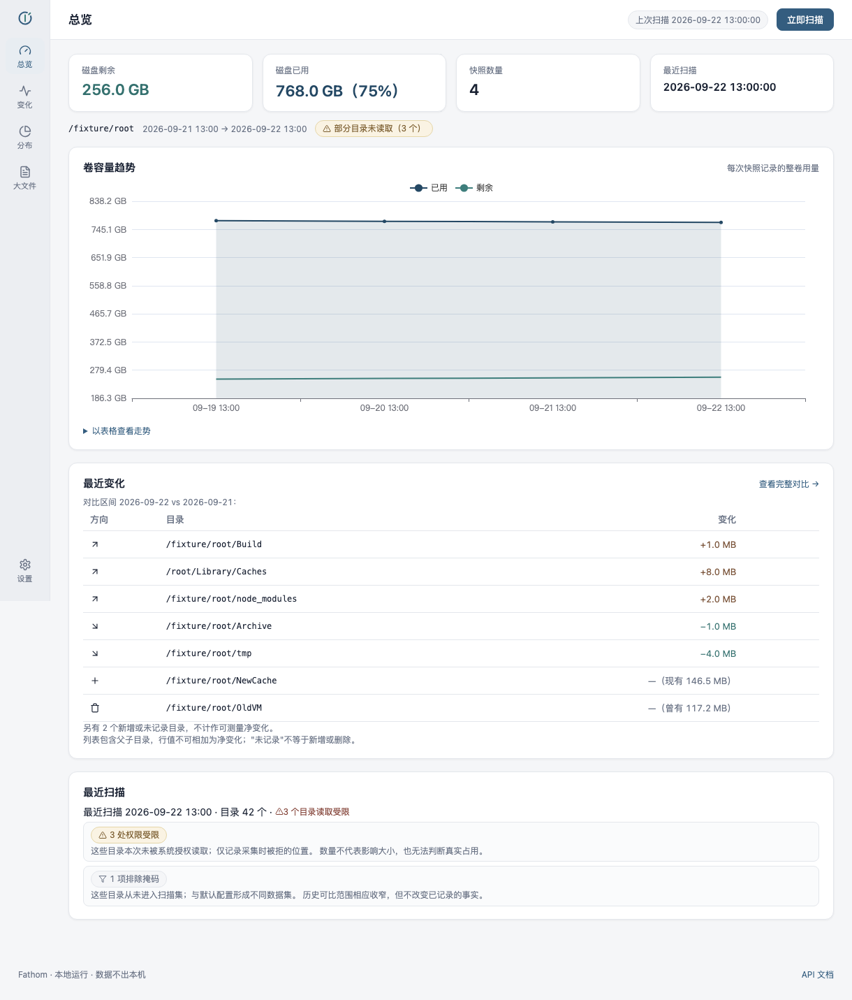

<div align="center">


# Fathom

**macOS 目录容量历史追踪工具** —— 记录哪些目录在增长，把最近变化与历史证据放在一起，帮助理解空间去向。

[](https://github.com/cat-xierluo/fathom/actions/workflows/ci.yml)
[](https://github.com/cat-xierluo/fathom/releases)
[](LICENSE)
[](#安装)

[功能](#功能特性) · [安装](#安装) · [快速上手](#快速上手) · [开发者指南](#开发者指南) · [文档](#文档)

</div>

## 为什么需要 Fathom

磁盘空间总是不知不觉就满了。系统自带的工具只能告诉你「现在」各目录多大，但真正有价值的问题是：

- **这周比上周多了什么？** 单次快照无法回答，需要连续多日的同口径测量。
- **删掉的东西为什么又长回来了？** 需要能回看任意时点的历史记录。
- **空间到底去哪了？** 需要把变化、大文件和目录结构放在一起看，而不是凭记忆猜。

Fathom 用系统 `du` 定期测量目录占用，把每个快照存进本地 SQLite，对比出增长、缩减与首次/不再出现的目录，配上趋势图和 Markdown 日报——**所有数据只存在你的机器上**。




## 功能特性

- **目录容量追踪**：按日定时扫描（默认 12:00），记录 ≥10 MiB 的目录累计占用；同口径的当日扫描自动替换当天快照。
- **变化对比**：任意两个有效日期之间的增长、缩减、首次出现与不再记录的目录，附增长/缩减排行。
- **历史趋势**：目录占用的多日趋势图与磁盘剩余空间变化。
- **大文件清单**：近期修改的大文件查询，快速定位「最近刚写入的东西」。
- **每日日报**：扫描完成后自动生成 Markdown 对比报告，并尝试发送 macOS 系统通知（含增长摘要、首记大目录与剩余空间告警）。
- **桌面应用**：Tauri 壳 + 菜单栏托盘，设置页管理监控范围、排除列表、扫描计划与阈值；数据完整保留本机，无遥测、无云端。
- **应用内更新**（v0.3.1 起）：检查更新 → 确认下载安装 → 确认重启；安装前自动停写与备份数据库，失败自动回滚到当前版本。
- **跨进程安全**：跨进程互斥保证同一时刻只有一次扫描；超时保护中断的扫描不会破坏上一次有效快照。

## 安装

**系统要求**：macOS（Apple Silicon，M 系列芯片）。Intel Mac 支持在计划中，Windows 不在当前计划。

1. 从 [Releases](https://github.com/cat-xierluo/fathom/releases) 下载最新 `Fathom_<版本>_aarch64.dmg`；
2. 校验完整性（可选但推荐）：终端执行 `shasum -a 256 <下载的DMG>`，与 Release 页 `checksums.txt` 比对；
3. 打开 DMG，把 Fathom 拖入 Applications；
4. **首次打开**：本应用未经 Apple 签名与公证（首次双击会被 Gatekeeper 拦截，属预期）——在 Finder 中**右键点按 Fathom → 打开 → 再点「打开」**；或在 系统设置 → 隐私与安全性 中点「仍要打开」。每次安装新版本后如遇「已损坏」提示，执行 `xattr -cr /Applications/Fathom.app` 后再打开。

<details>
<summary>应用内更新说明</summary>

v0.3.1 起内置生产更新签名与公开更新源：设置页可检查并安装后续版本（更新包经 minisign 签名校验，不可绕过）。v0.3.0 为更新基础设施就绪前的版本，从 v0.3.0 升级需手动下载 v0.3.1 覆盖安装一次。
</details>

## 快速上手

1. 启动 Fathom，在设置页选择**监控范围**（建议先从一个具体目录开始，整盘首扫耗时依文件数而定）与**排除列表**；
2. 设置每日扫描时间（默认 12:00），按引导授权后台任务；
3. 次日起在「变化」页查看与前一天的对比，或等待日报通知；
4. 磁盘吃紧时看「大文件」页和总览的增长排行。

**口径说明**：目录数字为 `du` 口径的累计占用；父子目录数字不能相加，目录大小不等于可回收空间；缺失条目不代表已删除（可能是权限或测量时点差异）。

## 开发者指南

环境：macOS、Python 3.14、Rust（Tauri 构建）。依赖分层锁定（直接依赖区间 + `constraints.txt` 全闭包精确版本）。

```bash
git clone https://github.com/cat-xierluo/fathom.git
cd fathom
python3.14 -m venv .venv
.venv/bin/python -m pip install -c packaging/constraints.txt -r packaging/requirements-dev.txt

# 本地门禁（与 CI 同口径）
/bin/bash scripts/ci_pytest.sh
/bin/bash scripts/ci_cargo_locked.sh
```

常用命令（会实际扫描或修改本用户后台任务，请在选定环境执行）：

```bash
.venv/bin/python -m fathom serve      # 127.0.0.1:7952 前台运行 Web 服务
.venv/bin/python -m fathom status     # 查看服务与扫描状态
.venv/bin/python -m fathom scan       # 手动扫描（默认 HOME，首扫建立基线）
.venv/bin/python -m fathom report     # 生成最近两快照对比日报
.venv/bin/python -m fathom bigfiles --days 7 --min-mb 100
.venv/bin/python -m fathom install    # 安装开发版两个 LaunchAgent
.venv/bin/python -m fathom uninstall  # 卸载开发版后台任务
```

Tauri 桌面壳：`cd apps/desktop/src-tauri && cargo run`（依赖上述服务另行运行）。构建未签名 DMG：`bash scripts/build_helper.sh && bash scripts/build_app.sh`（详见 [TESTING §4](docs/TESTING.md)）。

开发数据隔离（`FATHOM_RUNTIME_DIR` / `FATHOM_SCAN_ROOT` / `FATHOM_PORT` 等）与完整验证协议见 [TESTING](docs/TESTING.md)。

## 文档

| 文档 | 内容 |
|---|---|
| [ARCHITECTURE](docs/ARCHITECTURE.md) | 已实现模块、数据流与接口 |
| [DESIGN](docs/DESIGN.md) | 页面职责、交互与视觉合同 |
| [ROADMAP](docs/ROADMAP.md) | 产品方向与阶段目标 |
| [TESTING](docs/TESTING.md) | 验证协议与发布验收矩阵 |
| [CHANGELOG](CHANGELOG.md) | 用户可见变更记录 |
| [CONTRIBUTING](.github/CONTRIBUTING.md) | 贡献指南 |
| [SECURITY](.github/SECURITY.md) | 安全反馈渠道 |
| [第三方声明](docs/THIRD_PARTY_NOTICES.md) | 依赖许可与来源 |

## 已知限制

- 仅支持 Apple Silicon（arm64）；Intel Mac 双架构在计划内。
- 未做 Developer ID 签名与 Apple 公证（有意取舍，DMG 内附放行指引）；信任边界依赖 checksums 比对。
- 超大目录树（百万级）单次扫描可能超过 1 小时；`FATHOM_DU_TIMEOUT_S` 安全时限（默认 4 小时）到点后本次记「中断」，保留上次有效快照。
- 系统通知的实际展示受 macOS 通知策略影响。
- 扫描事实与解释严格分离：工具不执行清理、不删除任何文件。

## 故障处理

| 现象 | 排查 |
|---|---|
| 本地页面打不开 | 服务是否启动、7952 端口占用；launchd 部署查 `logs/launchd-web.err.log` |
| 首日无差分 | 需要两个不同有效日期；首扫保存基线后次日才有对比 |
| 首次打开提示「已损坏」 | 下载隔离属性所致：`xattr -cr /Applications/Fathom.app` 后重开 |
| 通知未显示 | 查 `logs/notify.log`；提交成功不保证横幅展示（系统策略） |
| 部分目录看不到 | 核查权限、10 MiB 入库阈值与测量时点 |

## 许可证

[Apache License 2.0](LICENSE) · Copyright 2026 maoking

第三方组件声明见 [THIRD_PARTY_NOTICES](docs/THIRD_PARTY_NOTICES.md)。
