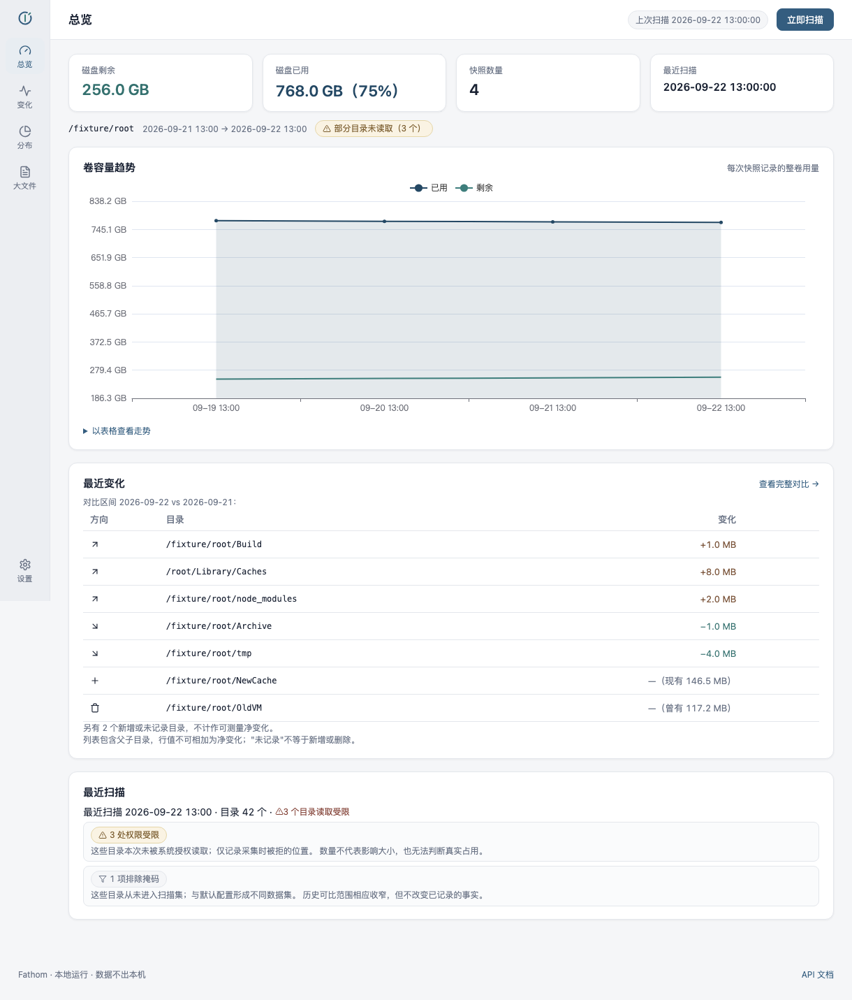
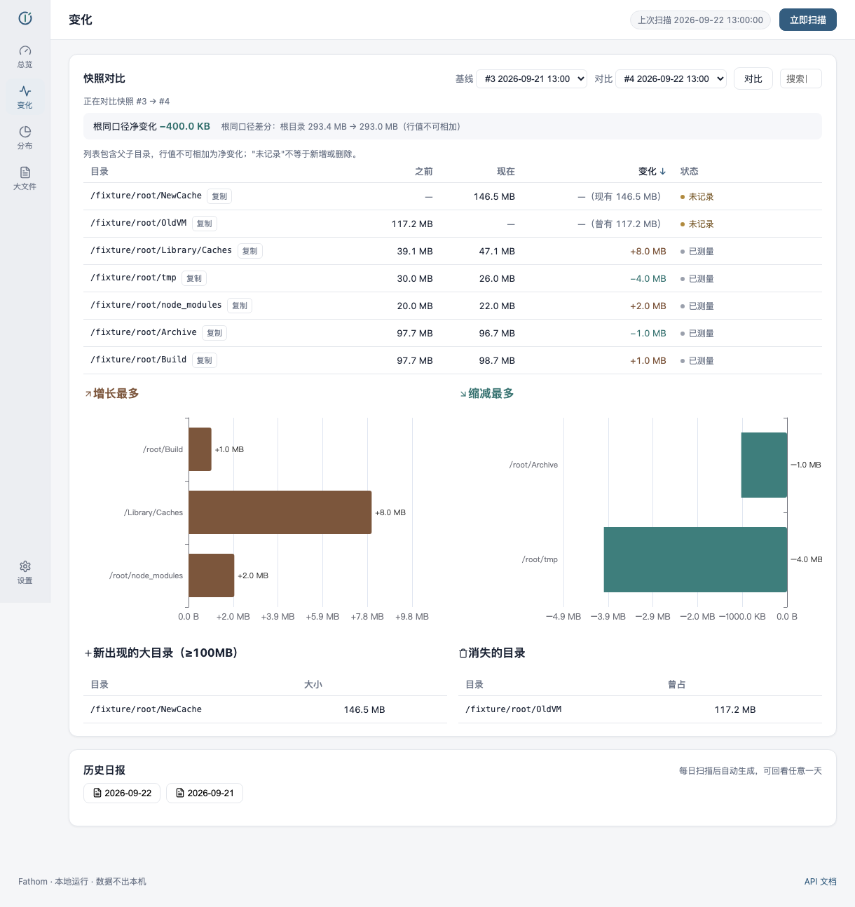

<div align="center">


# Fathom

**Disk Insight for macOS** —— 记录哪些目录在增长，把最近变化与历史证据放在一起，帮助理解空间去向。

[](https://github.com/cat-xierluo/fathom/actions/workflows/ci.yml)
[](https://github.com/cat-xierluo/fathom/releases)
[](LICENSE)
[](#安装)

[功能](#功能特性) · [安装](#安装) · [快速上手](#快速上手) · [开发者指南](#开发者指南) · [文档](#文档)

</div>

## 为什么需要 Fathom

磁盘空间总是不知不觉就满了。系统自带的工具只能告诉你「现在」各目录多大，但真正有价值的问题是：

- **这周比上周多了什么？** 单次快照无法回答，需要连续多日的同口径测量。
- **删掉的东西为什么又长回来了？** 需要能回看任意时点的历史记录。
- **空间到底去哪了？** 需要把变化、大文件和目录结构放在一起看，而不是凭记忆猜。

Fathom 用系统 `du` 定期测量目录占用，把每个快照存进本地 SQLite，对比出增长、缩减与首次/不再出现的目录，配上趋势图和 Markdown 日报——**所有数据只存在你的机器上**。





## 功能特性

- **目录容量追踪**：按日定时扫描（默认 12:00），记录 ≥10 MiB 的目录累计占用；同口径的当日扫描自动替换当天快照；读取受限时如实按 `du` 错误记录数说明，扫描校验无法确认的路径单独标注，不显示虚假覆盖率。
- **扫描范围可配置**（v0.4.0）：设置页新增「扫描范围」分区，可在启动盘与自定义目录之间选择并保存（原子写入、乐观版本冲突保护，路径/重复根/数量等非法配置直接拒绝）；首次启用给出分步引导。一条扫描计划可包含**多个范围**，一轮按范围顺序依次采集；部分范围失败时如实标注成功/失败明细而不是整体报错，未开始的范围记为「本轮不采集」而非失败。当前源码（未发布）中，桌面版未明确选择范围时，下一次主动扫描默认发现并采集内置启动盘所有可采集的挂载入口；发现失败会停止并说明原因。已有自定义范围、明确设置的单目录及开发隔离根保持优先，旧用户目录历史保留为独立数据集。
- **整盘总览与「排查这次变化」**（v0.4.0）：总览新增整盘容量读数（容器占用 / 整体剩余 / 最近一轮）与目录归因摘要，二者口径分开呈现；共享剩余空间只计一次，卷级读数不相加。目录测量与容器占用的差额按**有符号**差值如实解释：负值表示「目录测量增长大于容器占用增长」，不说成「容器占用减少」；两侧不可比时写明原因而不补 0。由总览可一键带区间进入变化页排查。
- **变化对比**：任意两个有效日期之间的增长、缩减、首次出现与不再记录的目录；明细为树形同级视图，按直属子目录逐层展开下钻，「聚焦此目录」与面包屑在层级间往返；目录的累计变化明确标注已包含后代，与子目录变化不重复相加，某一侧没有记录（低于阈值或无权限）如实显示「未记录」而不是 0。
- **快照选项按数据集收敛**（v0.4.0）：不同测量根/口径的快照不再混在同一列表里误选——对比基准侧保留全量列表作为切换入口（改基准即切换数据集），历史点侧收敛到当前基准所属数据集；只有一张快照的数据集也保留切换出口，不会静默卡住；构造出的无效组合会就地说明原因。
- **跨页排查不丢上下文**（v0.4.0）：总览 → 变化 → 目录详情 → 分布 → 设置往返后，树的展开层数、所选对比区间与焦点按会话恢复；快速切页、改范围或重复提交不会串读数或被旧响应覆盖。
- **历史趋势**：目录占用的多日趋势图与磁盘剩余空间变化；目录详情曲线跟随所选对比区间取点，中途没有记录的日期显示为断线并标注「未记录」，不补成假数据。
- **大文件清单**：「近期修改」（近 N 天刚写入的大文件）与「当前最大」（不受修改时间限制的现存最大文件）两种模式，可限定到指定目录范围；查询提交后可随时取消并查看进度，结果被预算截断时如实标注「已检查文件中的较大项」。
- **每日日报**：扫描完成后自动生成 Markdown 对比报告，并尝试发送 macOS 系统通知（含增长摘要、首记大目录与剩余空间告警）。
- **桌面应用**：Tauri 壳 + 菜单栏托盘，设置页管理监控范围、排除列表、扫描计划与阈值；数据完整保留本机，无遥测、无云端。
- **应用内更新**（v0.3.1 起）：发现新版本自动后台下载（默认开启，可在「关于」页关闭），安装与重启仍各自需要确认；安装前自动停写与备份数据库，升级期间持续停写并拒绝重入；安装失败可自动恢复旧版与数据（见已知限制）。
- **跨进程安全**：跨进程互斥保证同一时刻只有一次扫描；超时保护中断的扫描不会破坏上一次有效快照。
- **Agent 变化解读**（默认关闭）：侧栏“Agent”可独立选择历史区间、查看在途任务与跨区间历史，变化页仍可就地解读；无快照或未启用也能进入，配置留在设置页“AI 分析”。关闭引擎后仍可查看保留的历史；原快照过期会说明原因并保留可读原文与证据。设置页检测本机已有的 AI 命令行工具并选择其一（当前可用：Claude Code——禁用全部工具，推荐；Codex CLI——系统级只读沙箱，不可写入/删除/执行破坏命令，可读取本机任意文件、可联网；Hermes Agent——只读工具集（网页搜索/网页读取/图像分析），不可写入/删除/执行命令；其图像分析工具本身能读取本机图片并把图片内容交给其模型服务，但本应用不向它提供本机路径（事实包内路径已做别名脱敏）且提示词要求不调用工具，因此当前解读不会触发，不读取其他类型的本机文件；各家能力边界如实披露，其余如实标注不支持原因）；生成分析前先展示完整的发送预览，确认后才会发送给该工具所配置的模型服务；解读区分实测与推断、每条结论可跳回对应目录，可随时撤销且删除本机保存的记录。未启用时所有基础功能不受影响。

## 安装

**系统要求**：macOS（Apple Silicon，M 系列芯片）。Intel Mac 支持在计划中，Windows 不在当前计划。

1. 从 [Releases](https://github.com/cat-xierluo/fathom/releases) 下载最新 `Fathom_<版本>_aarch64.dmg`；
2. 校验完整性（可选但推荐）：终端执行 `shasum -a 256 <下载的DMG>`，与 Release 页 `checksums.txt` 比对；
3. 打开 DMG，把 Fathom 拖入 Applications；
4. **首次打开**：本应用未经 Apple 签名与公证（首次双击会被 Gatekeeper 拦截，属预期）——在 Finder 中**右键点按 Fathom → 打开 → 再点「打开」**；或在 系统设置 → 隐私与安全性 中点「仍要打开」。每次安装新版本后如遇「已损坏」提示，执行 `xattr -cr /Applications/Fathom.app` 后再打开。

<details>
<summary>应用内更新说明</summary>

v0.3.1 起内置生产更新签名与公开更新源：设置页可检查并安装后续版本（更新包经 minisign 签名校验，不可绕过）。v0.3.0 为更新基础设施就绪前的版本，从 v0.3.0 升级需手动下载 v0.3.1 覆盖安装一次。**v0.4.1 为未签名 arm64 热修版**：发布形态与 0.3.x 一致（未签名、未公证），仅提供 Apple Silicon 包，Intel 无桌面形态。

**升级准备反复失败（0.3.6）**：若更新包已下载并验签，安装仍在准备阶段失败，可能是旧后台进程退出后没有被桌面壳回收，被误判为仍在运行。此缺陷在已发布客户端中无法通过重新下载更新包自愈；退出 Fathom，按上面的 DMG 安装步骤覆盖应用即可升级。覆盖应用会保留运行根中的历史数据与设置，不要删除运行根。0.4.1 包含进程回收修复；0.3.6 已实测、0.4.0 代码仍存在该缺陷，需先手动覆盖一次。 更新失败回滚并恢复后台服务后，「关于」页会保留失败原因与重试入口；安装完成后的重启入口不会被自动检查覆盖。

</details>

## 快速上手

1. 启动 Fathom，在设置页选择**监控范围**（当前源码默认内置启动盘整体，已发布版请显式保存；也可改为自定义目录，首扫耗时依文件数而定）与**排除列表**；
2. 设置每日扫描时间（默认 12:00），按引导授权后台任务；
3. 次日起在「变化」页查看与前一天的对比，或等待日报通知；
4. 磁盘吃紧时看「大文件」页（近期修改 / 当前最大两种模式，可限定目录）和总览的增长排行；要定位变化发生在哪一层，在「变化」页的树形明细里逐层下钻。

**口径说明**：目录数字为 `du` 口径的累计占用；父子目录数字不能相加，目录大小不等于可回收空间；缺失条目不代表已删除（可能是权限或测量时点差异）。

## 开发者指南

环境：macOS、Python 3.14、Rust（Tauri 构建）。依赖分层锁定（直接依赖区间 + `constraints.txt` 全闭包精确版本）。

```bash
git clone https://github.com/cat-xierluo/fathom.git
cd fathom
python3.14 -m venv .venv
.venv/bin/python -m pip install -c packaging/constraints.txt -r packaging/requirements-dev.txt

# 本地门禁（与 CI 同口径）
/bin/bash scripts/ci_pytest.sh
/bin/bash scripts/ci_cargo_locked.sh
```

常用命令（会实际扫描或修改本用户后台任务，请在选定环境执行）：

```bash
.venv/bin/python -m fathom serve      # 127.0.0.1:7952 前台运行 Web 服务
.venv/bin/python -m fathom status     # 查看服务与扫描状态
.venv/bin/python -m fathom scan       # 手动扫描（默认 HOME，首扫建立基线）
.venv/bin/python -m fathom report     # 生成最近两快照对比日报
.venv/bin/python -m fathom bigfiles --days 7 --min-mb 100
.venv/bin/python -m fathom bigfiles --mode largest --path <扫描根内子目录> --topn 30
.venv/bin/python -m fathom install    # 安装开发版两个 LaunchAgent
.venv/bin/python -m fathom uninstall  # 卸载开发版后台任务
```

Tauri 桌面壳：`cd apps/desktop/src-tauri && cargo run`（依赖上述服务另行运行）。构建未签名 DMG：`bash scripts/build_helper.sh && bash scripts/build_app.sh`（详见 [TESTING §4](docs/TESTING.md)）。

开发数据隔离（`FATHOM_RUNTIME_DIR` / `FATHOM_SCAN_ROOT` / `FATHOM_PORT` 等）与完整验证协议见 [TESTING](docs/TESTING.md)。

## 文档

| 文档 | 内容 |
|---|---|
| [ARCHITECTURE](docs/ARCHITECTURE.md) | 已实现模块、数据流与接口 |
| [DESIGN](docs/DESIGN.md) | 页面职责、交互与视觉合同 |
| [ROADMAP](docs/ROADMAP.md) | 产品方向与阶段目标 |
| [TESTING](docs/TESTING.md) | 验证协议与发布验收矩阵 |
| [CHANGELOG](CHANGELOG.md) | 用户可见变更记录 |
| [CONTRIBUTING](.github/CONTRIBUTING.md) | 贡献指南 |
| [SECURITY](.github/SECURITY.md) | 安全反馈渠道 |
| [第三方声明](docs/THIRD_PARTY_NOTICES.md) | 依赖许可与来源 |

## 已知限制

- 仅支持 Apple Silicon（arm64）；Intel Mac 双架构在计划中，本次发布形态为**未签名 arm64**。
- 扫描范围配置的生效路径：范围经**应用内 Web 设置页 / 本地 API / 命令行**保存与生效；**桌面壳不读取范围配置来驱动扫描**，壳侧只有「容忍未知键与畸形结构」的只读接缝，属未完成的行为接线（ISS-174 核实结论）。
- 新范围（plan）身份数据**暂不支持 AI 变化解读**：解读请求会被如实拒绝（不做降级猜测），旧口径数据集不受影响。
- 未做 Developer ID 签名与 Apple 公证（有意取舍，DMG 内附放行指引）；信任边界依赖 checksums 比对。
- 超大目录树（百万级）单次扫描可能超过 1 小时；`FATHOM_DU_TIMEOUT_S` 安全时限（默认 4 小时）到点后本次记「中断」，保留上次有效快照。大库的目录历史趋势查询已走索引提速（毫秒级），代价是旧库首次补建索引约增加 93MB（百万档）。
- 应用内更新：升级前自动落盘旧版与数据库恢复材料，安装失败可自动恢复并可接续；真实安装环境的端到端验证仍在进行，遇到更新异常请保留安装日志反馈。
- 系统通知的实际展示受 macOS 通知策略影响。
- 扫描事实与解释严格分离：工具不执行清理、不删除任何文件。

## 故障处理

| 现象 | 排查 |
|---|---|
| 升级后仍显示旧页面 | 新版桌面按后台握手提供的资源 revision 加载完整界面，避免同端口沿用旧缓存；缺少资源身份时会提示后台版本不兼容，请退出旧版后台并重试握手，保留运行目录与历史 |
| 本地页面打不开 | 服务是否启动、7952 端口占用；launchd 部署查 `logs/launchd-web.err.log` |
| 首日无差分 | 需要两个不同有效日期；首扫保存基线后次日才有对比 |
| 首次打开提示「已损坏」 | 下载隔离属性所致：`xattr -cr /Applications/Fathom.app` 后重开 |
| 通知未显示 | 查 `logs/notify.log`；提交成功不保证横幅展示（系统策略） |
| 部分目录看不到 | 核查权限、10 MiB 入库阈值与测量时点 |
| 扫描范围改了但结果没变 | 范围配置经 Web 设置页 / API / 命令行生效；桌面壳不读取范围配置驱动扫描。请确认在设置页保存成功；未提供显式范围或单目录参数的 CLI 扫描会读取已保存范围 |
| 一轮里部分范围没采到 | 部分失败是设计行为：总览/轮次状态会列出成功与失败明细，未开始的范围记为「本轮不采集」；重扫该轮即可，不影响已成功范围的结果 |
| 变化页选不出想要的对比组合 | 不同测量根/口径的快照不混选：历史点侧只列当前基准所属数据集，改对比基准侧（全量列表）即可切换数据集 |
| 整盘差额显示为负 | 负值表示「目录测量增长大于容器占用增长」，不是「容器占用减少」；差额不是可回收空间，缺失或不可比时会写明原因而不补 0 |

## 许可证

[Apache License 2.0](LICENSE) · Copyright 2026 maoking

第三方组件声明见 [THIRD_PARTY_NOTICES](docs/THIRD_PARTY_NOTICES.md)。
