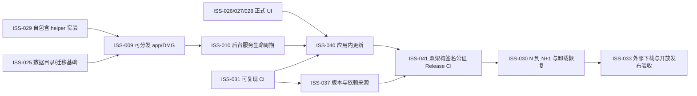

# Fathom v0.3.0 发行与自动更新方案

状态：目标方案，尚未完成发行验证  
基线：`main@8e7c07b`  
目标：首个可由其他 Mac 用户直接安装、Apple 验证、并能安全升级的 Fathom 版本

## 1. 结论

用户确认当前产品方向作为 v0.3.0 开发线继续收敛。这里的“v0.3.0”是发行目标，不表示当前仓库已经可发布：PR #10 是合成数据 UX 原型，生产 `frontend/` 尚未实装；Tauri 壳仍依赖外部 FastAPI/Python，`bundle.active=false`，各组件版本也不一致。

v0.3.0 只有同时满足以下结果才可成为公开候选：

1. Apple Silicon 与 Intel 各有原生、自包含的 thin app/DMG；
2. Developer ID Application 签名、hardened runtime、Apple 公证和 stapling 全部通过；
3. 正式 UI、后台 helper、数据目录和权限主体在安装态真实可用；
4. v0.3.0 到测试 v0.3.1 的应用内更新与失败恢复完成；
5. 依赖来源、许可证、版本、checksum 和发布说明可追溯；
6. 从实际下载入口在保留 quarantine 的干净账户完成启动与核心旅程。

## 2. 不能直接复制 Folia 的部分

Folia 已有双架构 Tauri updater 产物、签名、`latest.json`、draft Release 及更新 UI，可借鉴结构。Folia 当前没有 Developer ID 导入、Apple 公证与 stapling；其 README 仍包含绕过 quarantine 的做法，因此不能作为 Fathom 的公开发行验收证据。

Fathom 还不能直接复用：

- Folia updater 私钥；Fathom 必须有独立信任根；
- Gitee 镜像与 Windows 构建；v0.3.0 只做 macOS；
- 在 arm64 runner 上交叉构建 x86 Cargo target；冻结 Python helper 必须使用目标架构原生 runner；
- 宽泛 CSP、文件访问范围或 updater capability；更新由 Rust 壳协调；
- 可移动版本标签的第三方 Actions；接触 Apple 私钥的步骤固定完整 commit SHA。

## 3. 架构与任务顺序

ISS-029 与 ISS-031 可以并行：ISS-029 只在当前宿主架构证明自包含方法与 helper 合同，ISS-031 建立两个架构的 CI 基础；最终 arm64/x86_64 原生构建证据由 ISS-041 取得。ISS-040/041 不得提前修改生产 Tauri 配置来制造“看似能更新”的壳；它们必须等待自包含 app、后台退出协议和正式 UI 可用。

## 4. 自包含与双架构原则

- v0.3.0 分别发布 `darwin-aarch64` 与 `darwin-x86_64`，暂不做 universal2。
- Python helper 在相同目标架构的 macOS runner 冻结；验收 `file`、`otool -L`、断网启动及无 Python/Homebrew/Rust 账户。
- app 与 helper 建立身份、版本、health、启动和退出握手；端口占用时不得杀死未知进程。
- app bundle 资源只读，用户数据写入 Application Support；升级前 helper 停写并一致备份 SQLite。
- 后台唯一所有者与 TCC 授权主体由 ISS-029 实验决定，不能沿用写死项目路径的开发 launchd。

## 5. 两套独立签名

### Tauri updater

- `TAURI_SIGNING_PRIVATE_KEY`
- `TAURI_SIGNING_PRIVATE_KEY_PASSWORD`

为 Fathom 单独生成 keypair。公钥进入 `tauri.conf.json`，私钥和密码只放 GitHub Secrets；另做仓库外加密备份。私钥丢失会阻断已安装客户端的后续升级。

### Apple Developer ID 与公证

代码签名：

- `APPLE_CERTIFICATE`：Developer ID Application `.p12` 的 base64
- `APPLE_CERTIFICATE_PASSWORD`
- `APPLE_SIGNING_IDENTITY`

公证首选 App Store Connect API key：

- `APPLE_API_ISSUER`
- `APPLE_API_KEY`：Key ID
- `APPLE_API_KEY_P8`：`.p8` 内容；CI 写入临时文件并仅传路径

Apple Developer Program 资格、Developer ID Application 证书、私钥与 App Store Connect API key 只能由用户的 Apple 账户创建。凭据不进入聊天、PR、日志或仓库。`GITHUB_TOKEN` 由 Actions 自动提供，只给 release job 最小 `contents: write`。

## 6. Release 流水线

1. tag 必须与单一版本源、Python/API/Tauri/Cargo 完全一致；
2. arm64 与 Intel runner 各自锁定依赖、冻结 helper、构建 app/DMG/updater bundle；
3. 临时 keychain 导入 Developer ID 证书，签名嵌套 helper、framework 与 app；
4. 提交 Apple 公证并 staple；
5. 执行 `codesign --verify --deep --strict --verbose=2`、`spctl --assess --type execute -vv`、`xcrun stapler validate`；
6. 创建 draft Release，上传两个 DMG、两个 updater tar.gz、两个 `.sig`、checksums；
7. 聚合 job 校验两个平台齐全后生成 `latest.json`；任一架构、签名或公证缺失时 fail closed；
8. PM 从 GitHub 实际下载并在干净账户验证后，才提交公开发布给用户最终审阅。

## 7. 自动更新与私有仓库

普通客户端不能匿名读取 private GitHub Release，客户端中也不能嵌入 PAT。因此仓库保持 private 时：

- 允许构建内部 RC 与 draft Release；
- 生产 updater endpoint 默认关闭；
- 真实升级测试由 PM/CI 认证下载 private draft 资产，再把已签名更新包和测试 manifest 放入可撤销的匿名 HTTPS staging 源；客户端不接触 GitHub token，测试后删除 staging 资产；
- v0.3.0 外部自动更新前，必须选择把代码仓转 public，或把签名产物与 `latest.json` 放在独立公开下载仓/CDN。

自动更新采用“启动后延迟检查 → 展示版本和变更 → 用户确认下载/安装 → 明确重启”。离线、超时或更新失败不阻塞基础功能；签名失败不可绕过。

## 8. 发布门禁与停止条件

- 任何真实值缺失时只登记 secret 名，不生成虚假凭据或降低验收。
- updater key 可以在实现阶段生成，但未验证仓库外备份前不交付给已安装用户。
- Apple 身份或公证材料缺失时，流水线保持 draft/失败；不使用 `xattr` 绕过系统保护。
- 许可证未由用户选择前，不将仓库转 public。
- 公开 Release、公开仓库和外部邀请仍由用户审阅具体候选后批准。

## 9. 官方依据

- [Tauri macOS 签名与公证](https://v2.tauri.app/distribute/sign/macos/)
- [Tauri Updater](https://v2.tauri.app/plugin/updater/)
- [Tauri GitHub 发布流水线](https://v2.tauri.app/distribute/pipelines/github/)
- [Tauri Sidecar](https://v2.tauri.app/develop/sidecar/)
- [Apple 软件公证](https://developer.apple.com/documentation/security/notarizing_macos_software_before_distribution)
- [GitHub-hosted runner 架构](https://docs.github.com/en/actions/reference/runners/github-hosted-runners)
- [GitHub Release assets 鉴权](https://docs.github.com/en/rest/releases/assets)
